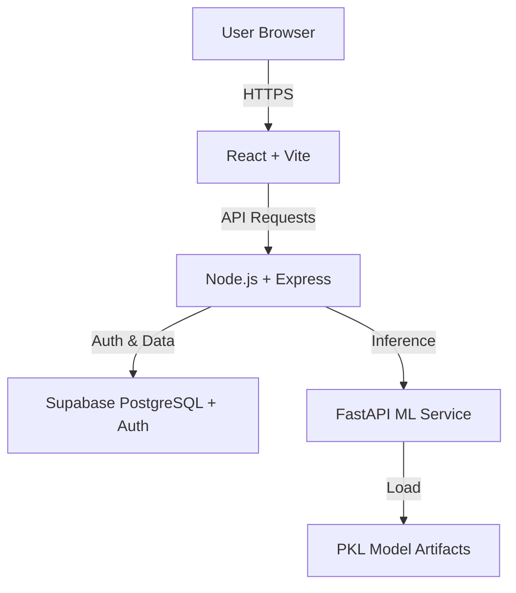

# NeuroShield Project Context

**Last Updated:** 2025-11-23
**Status:** Active Development

## 📋 Project Overview

**NeuroShield** is an AI-powered clinical decision support system designed to predict stroke risk in patients. It combines a React frontend, Node.js/Express backend, and a Python/FastAPI machine learning service to provide accurate, explainable risk assessments.

**Live URL:** https://neuro-shield.netlify.app

### Key Features
- **Stroke Risk Prediction:** Uses a Balanced Random Forest model (XGBoost/Scikit-learn) to predict 5-year stroke risk.
- **Explainability (LIME):** Provides local, interpretable explanations for each prediction (key factors).
- **Role-Based Access Control (RBAC):** Distinct roles for **Doctors**, **Patients**, and **Admins**.
- **Patient Management:** Comprehensive record keeping, medical history, and health metrics.
- **Analytics Dashboard:** Visualizations of patient risk distributions, trends, and demographics.
- **Secure Authentication:** Supabase Auth with HTTP-only cookies and JWT.

---

## 🏗️ Architecture

The system follows a microservices-inspired architecture:



### Components
1.  **Frontend (Client-React):**
    *   **Tech:** React 18, Vite, Tailwind CSS, Recharts, React Router.
    *   **Role:** UI/UX, state management, API integration.
    *   **Key Pages:** Dashboard, Patient Management, Prediction Interface, Analytics.

2.  **Backend (Express API):**
    *   **Tech:** Node.js, Express, Supabase Client.
    *   **Role:** API Gateway, Business Logic, Auth Verification, ML Proxy.
    *   **Auth:** Verifies Supabase JWTs via HTTP-only cookies.

3.  **ML Service (Python):**
    *   **Tech:** FastAPI, Scikit-learn, XGBoost, LIME, NumPy.
    *   **Role:** Model inference, feature preprocessing, explainability generation.
    *   **Artifacts:** `best_model.pkl` (or `stroke_balanced_rf_pipeline.pkl`), `scaler.pkl`, `lime_config.pkl`.

4.  **Database (Supabase):**
    *   **Tech:** PostgreSQL.
    *   **Role:** User data, patient records, prediction history, medical logs.
    *   **Auth:** Handles user signup/login and JWT generation.

---

## 🔐 Authentication & Security

### Auth Flow
1.  **Login:** User credentials sent to Backend -> Supabase Auth.
2.  **Token:** Supabase returns JWT. Backend sets it as an `httpOnly`, `secure`, `sameSite` cookie (`neuroShieldToken`).
3.  **Verification:** Middleware verifies this token on protected routes.
4.  **RBAC:**
    *   **Patient:** Can view own data, alerts, profile.
    *   **Doctor:** Can manage patients, run predictions, view analytics.
    *   **Admin:** Full system access.

### Security Measures
*   **HTTP-Only Cookies:** Prevents XSS attacks accessing tokens.
*   **CSRF Protection:** `sameSite` cookie policies (Lax/Strict/None based on env).
*   **Row Level Security (RLS):** Supabase policies restrict data access at the database level.

---

## 🛠️ Setup & Installation

### Prerequisites
*   Node.js v18+
*   Python 3.10+
*   Supabase Account

### 1. Backend Setup
```bash
cd Neuro-Shield
npm install
# Create .env file with:
# SUPABASE_URL=...
# SUPABASE_KEY=...
# JWT_SECRET=...
# ML_SERVICE_URL=http://localhost:8000
npm start
```

### 2. Frontend Setup
```bash
cd client-react
npm install
# Create .env.local with:
# VITE_API_URL=http://localhost:5000/api
npm run dev
```

### 3. ML Service Setup
```bash
cd ml-service
python -m venv venv
# Windows: venv\Scripts\activate
# Mac/Linux: source venv/bin/activate
pip install -r requirements.txt
# Ensure .pkl model files are present in ml-service/
uvicorn main:app --host 0.0.0.0 --port 8000 --reload
```

---

## 📚 API Documentation

**Base URL:** `/api`

### Auth
*   `POST /signup`: Register new user (Doctor/Patient).
*   `POST /login`: Authenticate and set cookie.
*   `POST /logout`: Clear session.

### Patients (Doctor Only)
*   `POST /patient/create`: Add new patient.
*   `GET /patient/list`: List managed patients.
*   `GET /patient/:id`: Get patient details.
*   `POST /patient/update/:id`: Update record.

### Prediction
*   `POST /predict`: Run stroke risk prediction.
    *   **Required Fields:** `age`, `avg_glucose_level`, `bmi`.
    *   **Optional (Recommended):** `hypertension`, `heart_disease`, `smoking_status`.
*   `GET /predict/patient/:id`: Get prediction history.

### Analytics
*   `GET /analytics/dashboard`: Get risk distribution, trends, and demographics.

---

## 🤖 ML Service Details

**Model:** Balanced Random Forest Classifier.
**Training Data:** Stroke dataset (~43k records).
**Performance:** Optimized for Recall (Sensitivity) to minimize false negatives.

### Input Features
| Feature | Type | Description |
| :--- | :--- | :--- |
| `age` | Float | Patient age |
| `avg_glucose_level` | Float | Average blood glucose |
| `bmi` | Float | Body Mass Index |
| `hypertension` | Binary | 0/1 |
| `heart_disease` | Binary | 0/1 |
| `smoking_status` | Categorical | never/formerly/smokes |

### Troubleshooting ML
*   **"ML service not available":** Ensure FastAPI is running on port 8000.
*   **"Model not loaded":** Check `.pkl` files in `ml-service/`.
*   **"Missing data":** Ensure patient record has Age, BMI, and Glucose.

---

## 🗄️ Database Schema

### Tables
*   `users` (Supabase Auth): Managed by Supabase.
*   `doctors`: Profile data linked to `auth.users`.
*   `patients`: Clinical data, linked to `auth.users` (if registered) or standalone.
*   `predictions`: Stores model outputs, probabilities, and LIME factors.
*   `medical_records`: Files and documents.
*   `health_metrics`: Time-series health data (BP, weight, etc.).

### Triggers
*   `handle_new_user`: Automatically creates a profile in `doctors`, `patients`, or `admins` table upon signup based on metadata role.

---

## 📂 Project Structure

```
Neuro-Shield/
├── client-react/           # Frontend (React)
│   ├── src/
│   │   ├── pages/          # Dashboard, Patients, Auth
│   │   ├── components/     # UI, Layout, Charts
│   │   ├── services/       # API Client
│   │   └── contexts/       # AuthContext
├── controllers/            # Backend Logic
├── routes/                 # API Routes
├── middlewares/            # Auth & RBAC
├── ml-service/             # Python ML API
│   ├── main.py
│   ├── requirements.txt
│   └── *.pkl               # Model Artifacts
├── supabase/               # Migrations & SQL
└── app.js                  # Express Entry Point
```
