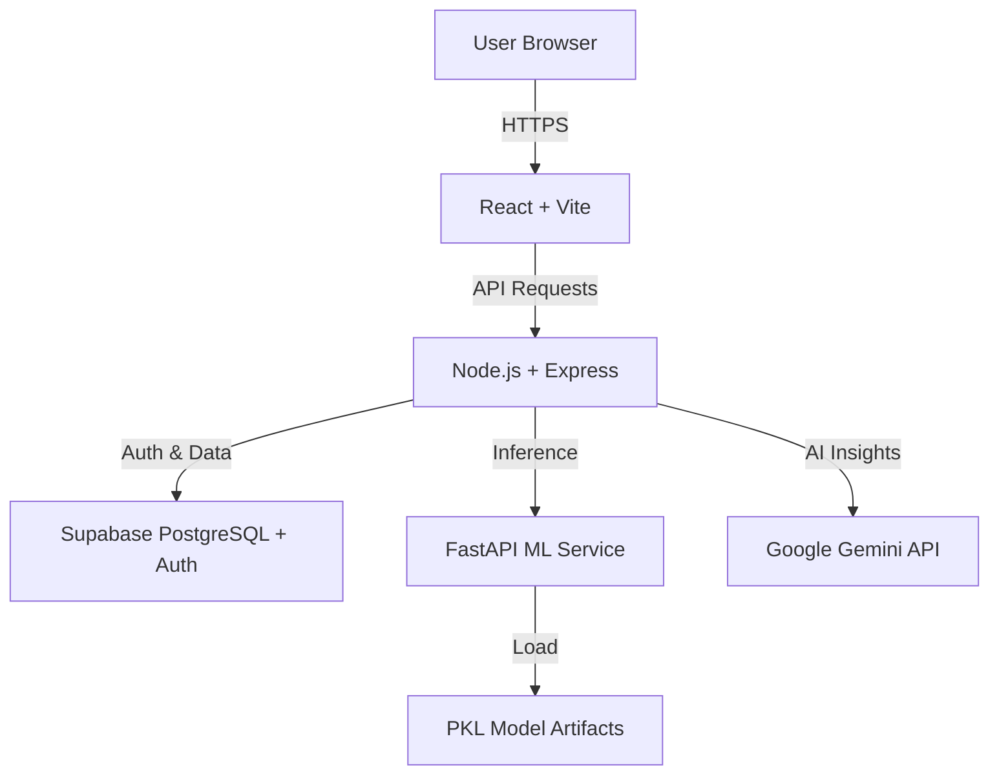

# NeuroShield Project Context

**Last Updated:** 2025-11-24
**Status:** Active Development

## 📋 Project Overview

**NeuroShield** is an AI-powered clinical decision support system designed to predict stroke risk in patients. It combines a React frontend, Node.js/Express backend, and a Python/FastAPI machine learning service to provide accurate, explainable risk assessments.

**Live URL:** https://neuro-shield.netlify.app

### Key Features
- **Stroke Risk Prediction:** Uses a Balanced Random Forest model (XGBoost/Scikit-learn) to predict 5-year stroke risk.
- **Explainability (LIME):** Provides local, interpretable explanations for each prediction (key factors).
- **AI Health Assistant:** Integrates **Google Gemini API** to provide personalized health recommendations (Diet, Exercise, Precautions) based on patient vitals and risk profile.
- **Role-Based Access Control (RBAC):** Distinct roles for **Doctors**, **Patients**, and **Admins**.
- **Patient Dashboard:** A redesigned, patient-centric dashboard with health metrics, AI insights, and medical records.
- **Doctor-Patient Relationship:** Many-to-many relationship allowing patients to have multiple doctors and doctors to manage multiple patients.
- **Secure Authentication:** Supabase Auth with HTTP-only cookies and JWT.

---

## 🏗️ Architecture

The system follows a microservices-inspired architecture:



### Components
1.  **Frontend (Client-React):**
    *   **Tech:** React 18, Vite, Tailwind CSS, Recharts, React Query, Lucide React.
    *   **Role:** UI/UX, state management, API integration.
    *   **Key Pages:** Patient Dashboard (Redesigned), Staff Dashboard, Profile, Prediction Interface.

2.  **Backend (Express API):**
    *   **Tech:** Node.js, Express, Supabase Client (`supabase-js`), Google Generative AI (`@google/generative-ai`).
    *   **Role:** API Gateway, Business Logic, Auth Verification, ML Proxy, AI Orchestration.
    *   **Auth:** Verifies Supabase JWTs via HTTP-only cookies.

3.  **ML Service (Python):**
    *   **Tech:** FastAPI, Scikit-learn, XGBoost, LIME, NumPy.
    *   **Role:** Model inference, feature preprocessing, explainability generation.
    *   **Artifacts:** `best_model.pkl`, `scaler.pkl`, `lime_config.pkl`.

4.  **Database (Supabase):**
    *   **Tech:** PostgreSQL.
    *   **Role:** User data, patient records, prediction history, medical logs, AI recommendations.
    *   **Auth:** Handles user signup/login and JWT generation.

---

## 🔐 Authentication & Security

### Auth Flow
1.  **Login:** User credentials sent to Backend -> Supabase Auth.
2.  **Token:** Supabase returns JWT. Backend sets it as an `httpOnly`, `secure`, `sameSite` cookie (`neuroShieldToken`).
3.  **Redirects:**
    *   **Patients:** Redirected to `/patients/dashboard`.
    *   **Doctors:** Redirected to `/staff`.
    *   **Admins:** Redirected to `/admin`.
4.  **RBAC:**
    *   **Patient:** Can view own data, generate AI insights, update profile.
    *   **Doctor:** Can manage linked patients, run predictions, view analytics.
    *   **Admin:** Full system access.

### Security Measures
*   **HTTP-Only Cookies:** Prevents XSS attacks accessing tokens.
*   **Row Level Security (RLS):** Supabase policies restrict data access.
    *   *Note:* Backend uses `supabaseAdmin` (Service Role) for specific operations (like AI generation) to bypass RLS when necessary, while standard operations use the user's context.

---

## 🛠️ Setup & Installation

### Prerequisites
*   Node.js v18+
*   Python 3.10+
*   Supabase Account
*   Google Gemini API Key

### 1. Backend Setup
```bash
cd Neuro-Shield
npm install
# Create .env file with:
# SUPABASE_URL=...
# SUPABASE_KEY=...
# SUPABASE_SERVICE_ROLE_KEY=... (Required for Admin ops)
# GEMINI_API_KEY=...
# JWT_SECRET=...
# ML_SERVICE_URL=http://localhost:8000
npm start
```

### 2. Frontend Setup
```bash
cd client-react
npm install
# Create .env.local with:
# VITE_API_URL=http://localhost:5000/api
npm run dev
```

### 3. ML Service Setup
```bash
cd ml-service
python -m venv venv
# Windows: venv\Scripts\activate
# Mac/Linux: source venv/bin/activate
pip install -r requirements.txt
uvicorn main:app --host 0.0.0.0 --port 8000 --reload
```

---

## 📚 API Documentation

**Base URL:** `/api`

### Auth
*   `POST /signup`: Register new user.
*   `POST /login`: Authenticate.
*   `GET /dashboard`: Get current user context.

### Patient Operations
*   `GET /patient/:id` (or `detail`): Get patient profile.
*   `POST /patient/update/:id`: Update patient profile.
*   `POST /patient/generate-recommendations`: Generate AI health insights.
*   `GET /patient/recommendations`: Get latest AI insights.
*   `GET /patient/my-doctors`: List linked doctors.
*   `POST /patient/add-doctor`: Link a doctor by email.

### Doctor Operations
*   `GET /doctor/profile`: Get doctor profile.
*   `POST /doctor/update`: Update doctor profile.
*   `GET /patient/list`: List all linked patients.

### Prediction
*   `POST /predict`: Run stroke risk prediction.

---

## 🗄️ Database Schema

### Core Tables
*   `users` (Supabase Auth): Managed by Supabase.
*   `doctors`: Profile data linked to `auth.users`.
*   `patients`: Clinical data, linked to `auth.users`.
*   `patient_doctors`: Junction table for Many-to-Many relationship.
*   `patient_recommendations`: Stores JSONB AI recommendations.
*   `predictions`: Stores model outputs.

### Recent Changes
*   **Patient Dashboard:** Redesigned with a "Clean Medical" aesthetic (Dark Teal sidebar).
*   **Profile Page:** Unified profile management for both Patients and Doctors.
*   **AI Integration:** Added `generateAIRecommendations` controller and `patient_recommendations` table.

---

## 📂 Project Structure

```
Neuro-Shield/
├── client-react/           # Frontend (React)
│   ├── src/
│   │   ├── pages/          # Dashboard, Patients, Auth, Profile
│   │   ├── components/     # UI (Shell, Cards), Layout
│   │   ├── services/       # API Client (api.js)
│   │   └── contexts/       # AuthContext
├── controllers/            # Backend Logic (patient, doctor, ai)
├── routes/                 # API Routes
├── middlewares/            # Auth & RBAC
├── ml-service/             # Python ML API
├── supabase/               # Migrations & SQL
└── app.js                  # Express Entry Point
```
